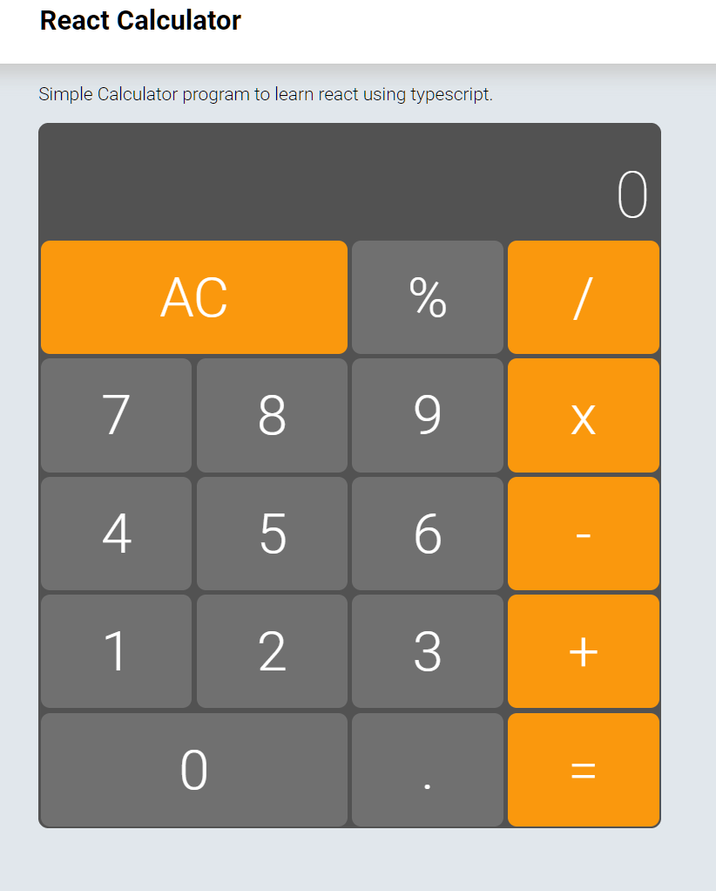

## React Calculator

Simple Calculator program to learn study React using typescript.
## Click to see the [Live Demo](https://leonibr.github.io/react-calculator/)
### This is a working in progress.

Using:

1. React
1. Unit tests
```javascript
test('After division entry must be null', () => {
    const history = new HistoryApp();
    history.setMemory(4);
    history.updateEntry(2);
    const result = divisionOperation(history);
    expect(result.entry).toBeNull();
});
```
1. Scss
```scss
@import '../variables';

.keyboard-container {
  display: flex;
  flex-direction: column;
  align-items: stretch;
  justify-content: stretch;
  max-width: 50vw;
  min-width: 420px;
  min-height: 60vh;

  & > .keyboard {
    display: grid;
    width: 100%;
```
1. Integrate beep on keypress


## Getting Started

```bash
> git clone https://github.com/leonibr/react-calculator.git
> cd react-calculator
> npm install
> npm start
```

## Screen



## License
1. MIT, enjoy
